# STYLE GUIDE — «Сортуй!»

Візуальний style-гайд проєкту. Це **джерело правди** про те, як гра
виглядає і чому саме так. Мета документа — щоб будь-яку нову механіку,
екран чи ассет можна було зробити «в стилі» без здогадок: узяв правило →
застосував.

Супутні документи:
- [`asset-spec.md`](asset-spec.md) — ТЗ для художника (розміри, формати, поставка).
- [`mockup-spec.md`](mockup-spec.md) — вимоги до мокапів екранів (лейаут, safe areas).
- [`../ARCHITECTURE.md`](../ARCHITECTURE.md) — шари й контракт модуля механіки.

Цей гайд — про «як має виглядати і відчуватися». Ті два — про «в яких
пікселях і файлах здавати».

---

## 0. Стрижень: зошит у клітинку

> **Уся гра — це малюнок від руки в шкільному зошиті в клітинку.**
> Кожен елемент виглядає так, ніби його щойно намалювали ручкою або
> олівцем на папері, а спецмеханіки — це реальні предмети, покладені
> зверху на цей аркуш (скотч, печатка, закладка, скріпка, замок).

Це не «тема оформлення», а **концепція**. З неї виводиться все інше. Коли
виникає питання «а як це має виглядати?», відповідь завжди одна:

**«Як би це намалювала/поклала на аркуш людина від руки?»**

Три наслідки, які проходять крізь увесь код:

1. **Нічого ідеально рівного.** Лінії тремтять, кути злегка завалені,
   стікери приклеєні криво. Ідеальна геометрія читається як «комп'ютерне»
   і ламає стиль.
2. **Колір завжди дубльований.** Папір і олівець — низькоконтрастне
   середовище, тож тип блока впізнається не лише кольором, а ще формою,
   патерном-штриховкою і символом (дальтонік-френдлі, п.3.2).
3. **Механіка = фізичний предмет.** Нову механіку не «вигадуємо іконку»,
   а питаємо: *який реальний об'єкт зі світу зошита це робить?* Скотч
   заклеює. Печатка запечатує. Замок замикає. Закладка позначає готове.

---

## 1. Головна інженерна ідея стилю: procedural-first, art-optional

Найважливіше архітектурне рішення візуалу: **гра повністю грабельна і
виглядає правильно навіть коли жодного ассета немає.** Кожен намальований
художником файл має програмного двійника — «sketch»-заглушку, що малюється
кодом у тому ж стилі.

- Ассети реєструються в [`public/assets/manifest.json`](../public/assets/manifest.json).
  Ключ у грі = ім'я файлу. Немає ключа в маніфесті → рендериться
  процедурна заглушка. Заміна ассета = перезапис одного файлу, **без змін
  коду**.
- Патерн у коді всюди однаковий:
  ```ts
  if (hasTexture(this.scene, ASSET_KEYS.columnFrame)) {
    // артова текстура (nine-slice)
  } else {
    // процедурний sketch-фолбек (drawFrameProcedural)
  }
  ```

**Чому це правило стилю, а не лише технічне зручність:** воно змушує стиль
жити в *правилах*, а не в *файлах*. Тремтіння лінії, штриховка, палітра,
кути — усе описано кодом (`src/ui/sketch.ts`). Художня поставка — це
«запечена в PNG» версія тих самих правил. Тому й арт, і заглушка виглядають
як одна гра.

> **Правило для нової механіки:** спочатку робиться процедурний вигляд
> (він і є специфікацією стилю), потім за потреби замовляється арт. Ніколи
> навпаки. Код без ассета мусить бути презентабельним.

---

## 2. Кольорова палітра

Єдине джерело — `COLORS` у [`src/app/gameConfig.ts`](../src/app/gameConfig.ts).
Значення в коді — hex-int (`0xRRGGBB`), для тексту є `*Css`-варіанти.

| Токен | Hex | Роль |
|---|---|---|
| `paper` | `#fdfcf6` | Фон-папір. Тепло-білий крем, не чисто-білий (екран не «світиться»). |
| `grid` | `#588cc8` | Синя сітка зошита. Малюється з alpha **0.15** — ледь видима. |
| `ink` | `#2b3a67` | Основне «чорнило». Темно-синій, **не чорний** — так виглядає синя кулькова ручка. Весь основний текст і контури. |
| `pencil` | `#606678` | Сіро-олівцевий. Другорядне: дудли, підказки-стрілки, службові позначки. |
| `accentWarm` | `#d97b1f` | Тепла помаранчева — «вибрано/увага». |
| `accentGreen` | `#2e7a3f` | Зелена — «валідно/успіх/зроблено». |
| `danger` | `#c8452c` | Червона — «небезпечно/скасувати/видалити». Тільки для деструктивних дій. |
| `noteYellow` | `#fff3b0` | Жовтий стікер/маркер — акценти, sticky-нотатки, primary-підложка. |

Похідні відтінки (у коді як локальні константи, з тієї ж родини):

- Тепле підсвічування вибраної рамки-контуру: `#f6a94a` (яскравіший за
  `accentWarm`, бо це тонкий контур поверх білої бази).
- Зелений фолбек цілі: заливка `#e0f4e4`, тінт-контур `#c4ecc9`.
- Чорнильна пляма: `#3b3e49` (майже графіт).
- Ключ-блок: крем `#fff6d8` + золотий контур `#b8860b`, друзки `#d9a521`.
- Печатка/ланцюг (сірий тінт): `#b2b2b6`, сокет медальйона `#e9e3d5`.

**Правило:** новий колір береться з палітри або як відтінок із неї.
Насичені «цифрові» кольори (чистий `#ff0000`, `#00ff00`) заборонені — вони
не з зошита. Виняток — кольори самих блоків (див. нижче), і ті приглушені.

---

## 3. Блоки — головний ігровий об'єкт

### 3.1 Дві палітри блоків і навіщо

Є **дві** таблиці кольорів блоків, і це навмисне:

- `BLOCK_STYLES` — «чорнильні» константи: колір **контуру + символу +
  штриховки** для процедурного блока. Це те, чим блок *намальований*.
- `BLOCK_TINTS` — «сприйнятий» колір, **насемпльований з готового арту**
  (`block_N.png`) скриптом [`tools/art/sample-block-tints.mjs`](../tools/art/sample-block-tints.mjs).
  Це те, яким блок *здається оку*.

Навіщо друга: коли UI має підхопити колір блока (стрілка над target-колонкою,
блок усередині печатки, іскра розриву ланцюга), він мусить збігтися з тим,
що бачить гравець на *арті*, а не з чорнильним контуром. Тому:

> **Правило:** усе, що фарбується «під колір блока», бере `BLOCK_TINTS`.
> Після будь-якої зміни арту блоків — перегенерувати:
> `node tools/art/sample-block-tints.mjs` і вставити в `gameConfig.ts`.

### 3.2 8 типів + подвійне кодування (дальтонік-френдлі)

Тип блока читається трьома незалежними каналами одночасно: **колір +
патерн-штриховка + символ**. Рівень має розв'язуватись навіть у чорно-білому.

**Канонічна специфікація (ціль).** Кожен із 8 типів = **центральний символ
+ власний патерн + власний відтінок**. Символ роблять **усім** блокам (не
половині) — це прибирає нерівну ієрархію «іконкові vs безликі патернові».
Форми обираються максимально різними за силуетом, щоб розрізнялись у ч/б.

| # | Родина відтінку | Символ | Патерн-штриховка |
|---|---|---|---|
| 0 | червоний | ♥ серце | діагональ ╱ |
| 1 | синій | △ трикутник | крапки |
| 2 | зелений | ◆ ромб | сітка (cross) |
| 3 | помаранчевий | ○ коло | горизонталі |
| 4 | фіолетовий | ✱ квіточка | вертикалі |
| 5 | коричневий (темніший — щоб не зливався з помаранчевим `3`) | ⬡ шестикутник | зворотна діагональ ╲ |
| 6 | бірюзовий | ☆ зірка | дрібні крапки |
| 7 | малиновий/рожевий (чіткіше й холодніше за червоний `0`) | ◼ квадрат | хвилі ≈ |

Рендер символу: у темнішому відтінку кольору блока, з тонким білим ореолом
~4px, щоб читався поверх штриховки. Штриховка — `fillPattern()` кольоровим
олівцем, alpha ~0.55 (штрих, не суцільна заливка). У фолбеку символ
рендериться шрифтом Caveat.

> **Поточний стан арту (звірено з файлами):** доставлені `block_N.png`
> частково відхиляються від таблиці вище — блоки `1, 2, 4, 5, 7` мають
> **лише патерн без центрального символу**, а теплі відтінки тісні
> (`0` лососево-червоний ≈ `7` рожевий; `3` помаранчевий ≈ `5` коричневий).
> Перемальовуються під цю специфікацію (промти — `docs/art-prompts.md`).
> Після оновлення арту → `node tools/art/sample-block-tints.mjs` і оновити
> `BLOCK_TINTS`. Фактичні насемпльовані tint'и зараз: `0 #f07f7b`,
> `1 #5685f9`, `2 #3bb04e`, `3 #f8b575`, `4 #9b62cb`, `5 #9a6e4c`,
> `6 #3cb6ba`, `7 #ee6396`.

Поточний доставлений арт:
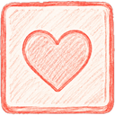
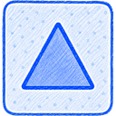
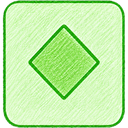
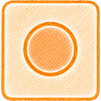
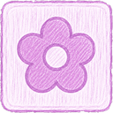
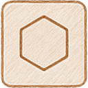
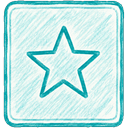
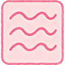

### 3.3 Спецблоки

| Блок | Вигляд | Читається як |
|---|---|---|
| Прихований |  заштрихований «?» | «невідомо, що всередині» — відкриється, коли стане верхнім |
| Ключ |  крем + золото + іконка ключа | «відкопай мене — відімкну замок» |
| Чорнильна пляма | 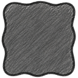 темна безформна пляма | «мертве місце: не взяти, не прибрати» |

Спецблок = впізнаваний **матеріал/предмет**, а не просто інший колір:
пляма — розлите чорнило, ключ — золотий металевий предмет серед паперових
блоків.

---

## 4. Типографіка

Дві рукописні гарнітури, self-hosted (`@fontsource`, bundled woff2,
offline-ready). Джерело — `FONTS` у `gameConfig.ts`.

| Роль | Шрифт | Де |
|---|---|---|
| `display` | **Caveat** | Заголовки, цифри, лейбли кнопок, «Готово ✓», HUD, номери рівнів — усе «крупне й рукописне». |
| `body` | **Neucha** | Дрібніший службовий текст, підписи, дудл-нотатки. Спокійніший, рівніший почерк. |

Правила:

- **Жодного запеченого тексту в ассетах.** Усі написи гра малює шрифтом
  (щоб локалізувати й тюнити без арту). На картинках слів/цифр немає.
- **Padding під гліфи.** Рукописні шрифти виходять за типографічні метрики
  — тексту завжди дають `padding: { x, y }`, інакше хвости літер зрізаються.
- **Легкий нахил.** Заголовки й стікери стоять під кутом −1.5°…+1.2° —
  «від руки нічого не стоїть ідеально рівно». Діалоги-панелі — рівно
  (0°), стікер-нотатки — з нахилом (~1.2°).
- **Мінімальний кегль:** 14px на телефоні, 16px на десктопі (WCAG AA
  контраст `ink` на `paper` — з запасом).

Орієнтовні кеглі (логічні px): заголовок лоббі 52, заголовок попапа 32,
тіло попапа 28, HUD 24, лейбл кнопки 22–24, дрібні підписи 13–17.

---

## 5. «Рука»: як малюються процедурні елементи

Уся процедурна графіка — у [`src/ui/sketch.ts`](../src/ui/sketch.ts). Це
буквальна кодова специфікація «намальованого від руки». Художник, роблячи
арт, імітує саме ці правила.

### 5.1 Детерміноване тремтіння

Ключовий трюк: тремтіння ліній **не випадкове, а детерміноване** — seed'иться
координатами (`jitter(seed, amp)` через `sin`-хеш). Тому при перемальовуванні
кадру лінія тремтить *однаково*, а не «кипить». Рух — тільки навмисний
(tween), фон стабільний.

> **Правило:** будь-яка «жива» неправильність (нахили, зсуви, розкидання
> дудлів) має бути детермінованою від seed (координата, `levelId`), а не
> `Math.random()` на кадр. Інакше картинка «вібрує».

### 5.2 Sketch-примітиви

- `strokeSketchRect(g, x, y, w, h, color, width, amp, dashedTop)` —
  прямокутник «намальований ручкою»: кожна сторона розбита на ~10px
  сегменти зі зсувом `amp` (1.2–1.6). `dashedTop` робить верх пунктирним
  (колонки «відкриті зверху»). Товщина 2.2–2.6.
- `fillPattern(g, x, y, w, h, kind, color)` — штриховка кольоровим
  олівцем: `stripes / cross / hlines / vlines / dots / solid`. Alpha 0.55.
  Це і є «розфарбовано олівцем», не суцільна заливка.
- «Паперова тінь» — не м'яка розмита тінь, а тонка темна смужка знизу
  об'єкта (`ink` @ alpha 0.12–0.16), як край піднятого над аркушем паперу.

### 5.3 Папір і сітка

`drawPaper()` / `PaperBackground`:
- Фон — тайл `bg_paper.png` (безшовний, здається @2x → `setTileScale(0.5)`),
  або процедурна сітка-фолбек: клітинка **24px**, лінії `grid` @ alpha 0.15.
- Фон ніколи не конкурує з блоками: він тихий, світлий, «на задньому плані
  зошита».

---

## 6. Поля зошита: дудли, декор, нотатки

Аркуш живе за рахунок **полів** — усе цікаве по краях, центр чистий під гру.

- **Дудли** (`src/ui/doodles.ts`): 30 універсальних `deco_doodle_NN` +
  10 механіко-специфічних `deco_sort_NN` (однорядкові підписи про
  сортування, підключаються тільки в сортувальних сценах). Розкидаються
  `scatterDoodles()` детerміновано за seed, з **виключенням зон** (UI +
  реальні межі поля з padding). Alpha **0.24**, нахил **±8°**, не
  перетинаються між собою. Малюються бліді — це фон, не контент.
- **Декор полів** (`drawMarginDecor`): спіралька, зірочка, дротяний куб,
  хрестики-нулики, стрілка-кривулька по кутах — «те, що малюють на полях,
  коли нудно». Олівець `pencil` @ alpha 0.3.
- **Рукописні нотатки** (`UI_TEXTS.decorNotes`): `«д/з: зібрати всі ★»`,
  `«3 однакових = ✓»`, `«не здавайся!»` — Caveat @ alpha 0.55 по краях,
  під кутом. Це «голос зошита».

> **Правило:** декор ніколи не залазить у зону гри й не перехоплює тапи.
> На телефоні набір дудлів менший (6 замість 8), щоб не тіснити поле.

Приклади дудлів:
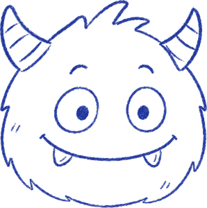


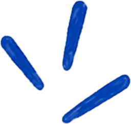

---

## 7. Матеріальні метафори механік ← найважливіший розділ для нових фіч

Кожна спецмеханіка — це **реальний предмет на аркуші**. Це головний прийом
дизайну: гравець розуміє правило, бо знає, як предмет поводиться в житті.
Розробляючи нову механіку, спочатку знаходиш предмет, потім малюєш.

| Механіка | Предмет | Що комунікує | Ассет + фолбек |
|---|---|---|---|
| Прихований блок | Перевернута «сорочка» | Не видно лиця → відкриється зверху | `block_hidden` / штриховка+? |
| Чорнильна пляма | Розлите чорнило | Мертвий слот, не чіпається | `block_ink` / темна плитка |
| Ключ-блок | Золотий ключ у завалі | Відкопай — сам відімкне | `block_key` / крем+`icon_key` |
| Замкнена колонка | Навісний замок(и) | Простір під замком, треба ключ | `icon_lock` ×N / 🔒 |
| Заклеєна колонка | Washi-скотч / клапан | Можна лише брати; спорожни — відклеїться | `tape_flap`→`deco_tape` / смужка |
| Target-колонка | Крейдяне прев'ю кольору | Першим сюди — тільки цей колір | (процедурно: привиди+стрілка) |
| Ланцюги/печатки | Воскова печатка з блоком | Набір цього кольору знімає печатку | `deco_seal` / сіра стрічка |
| Готова колонка | Закладка-стрічка | Ця колонка зібрана, інертна | `deco_ribbon` / washi «Готово ✓» |

Спільний принцип подачі: **«бачиш, але не чіпаєш»** — блоки в замкненій/
ланцюговій колонці видимі, але притемнені (`alpha 0.55`, «vaulted»). Це
«конструктивна необхідність»: гравець бачить, що всередині потрібне, і
розуміє, що колонку треба відкрити.

Прев'ю матеріалів:


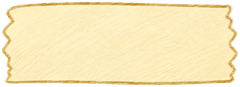
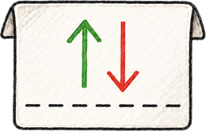
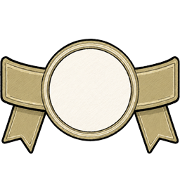
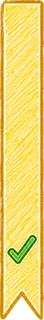
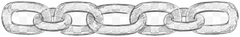

> **Рецепт нової механіки (візуальна частина):**
> 1. Назви предмет зі світу зошита, що робить цю дію.
> 2. Опиши його стан спокою (як лежить на аркуші) і як він реагує на
>    неправильну дію (сіпається/деренчить) і на виконання (відклеюється/
>    ламається/спадає).
> 3. Зроби процедурний фолбек у стилі sketch.
> 4. Додай ключ у `ASSET_KEYS` + запис у ТЗ художника з розміром і
>    nine-slice (якщо тягнеться).

---

## 8. Колонка та її стани

Колонка — вертикальна рамка `col_frame` (nine-slice, тягнеться під 3–4
блоки). Верх візуально «відкритий» — блоки заходять зверху.

| Стан | Вигляд | Реалізація |
|---|---|---|
| Звичайна | Біла рамка, чорнильний контур | `col_frame` |
| Вибрана | Тепла помаранчева обводка | база `col_frame` + `col_frame_tint`-контур, тінт `#f6a94a` |
| Валідна ціль | Зелена обводка + стрілка «сюди» | `col_frame_target` (фолбек тінт `#c4ecc9`) |
| Кольорова ціль | Обводка під колір блока + крейдяне прев'ю | база + `col_frame_tint`, тінт = `BLOCK_TINTS[color]` |
| Замкнена | N замків по центру + бирка «відкрити» | `col_frame` + `icon_lock`×N |
| У ланцюгах | Сірі печатки з блоками-«ключами» | `col_frame` + `deco_seal` |
| Заклеєна | Клапан/скотч зверху | `col_frame` + `tape_flap`/`deco_tape` |
| Готова | Закладка-стрічка по центру | `col_frame` + `deco_ribbon` |

**Важливе рішення про контур (не ламати):** вибрана й кольорова колонки
тримають **білу базу `col_frame`** і кладуть **тонкий тінтований контур**
поверх (`col_frame_tint`). Тінтувати саму базу — заллє всю колонку; брати
лише tint-рамку — контур стає напівпрозорим і «пікселявим» (крізь нього
світиться папір). Тому: база дає чіткий контур + непрозору білу заливку,
tint-оверлей сидить рівно на геометрії рамки.

Прев'ю рамок:
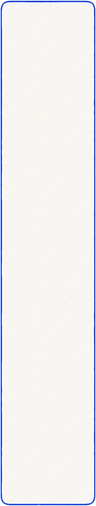
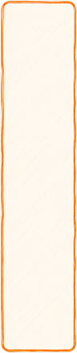
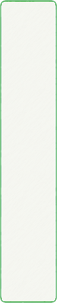

**Презентаційна перестановка колонок** (`displayPerm`): генератор додає
спецколонки у фіксованому порядку, тож без перемішування механіки завжди
сиділи б на тих самих місцях. View детерміновано (seed = `levelId`)
переставляє *візуальні* слоти, лишаючи логіку недоторканою. Замкнена
(ключова) колонка **завжди притиснута до правого краю** — гравець вчиться,
де «мета доступу».

---

## 9. Рух і анімація

Правило поділу праці:

> **Код робить рух (tween), атлас робить зміну текстури (кадрова анімація).**
> Приземлення, підйом, фліп, трясіння, пульс, відклеювання, спадання
> печатки, політ ключа — усе це програмні твіни. Покадрово малюються лише
> «стирання гумкою» блока (`block_clear`) і святковий сплеск (`sparkle`);
> обидва — з прозорим останнім кадром, обидва мають sketch-фолбек.

### 9.1 Тайминги (єдине джерело — `GAME_SETTINGS.animation`)

| Дія | Тривалість | Ease | Деталь |
|---|---|---|---|
| Приземлення групи | 200мс | `Back.easeOut` | старт з y−22, scale 0.92 → 1 (легкий overshoot) |
| Підйом вибраного | — | (миттєво) | верхня група вгору на **12px**, scale 1.03 |
| Фліп відкриття | 260мс | `Back.easeOut` | `scaleX: 0→1` (плитка «розкривається») |
| Пульс-підказка | 450мс | `Sine.easeInOut` | yoyo, repeat −1 (вимкнено за замовч.) |
| Стирання блока | 320мс, stagger 40мс | `Sine.easeIn` | alpha→0, scale 0.88, кут +4° |
| Трясіння (відмова) | 45мс | — | x −5, yoyo, repeat 2 |
| Іскри | 550мс, 8 шт | `Sine.easeOut` | розліт угору-врізнобіч, згасання |
| Розгортання закладки | 420мс | `Cubic.easeOut` | nine-slice росте по висоті згори |

### 9.2 Мова руху (easing як словник)

- **`Back.easeOut`** — «живий» settle з невеликим перельотом. Для
  приземлень, фліпів, появи стікерів, поп-апів (масштаб 0.85→1). Це
  «підпис» гри — все трохи пружинить, як від руки.
- **`Sine` / `Cubic.easeIn`** — гравітація й політ (спадання блоків,
  політ ключа по дузі, згасання іскор).
- **Фізична правдоподібність важливіша за тайминг.** Реакції предметів
  копіюють реальність:
  - Скотч **відклеюється** з одного краю → загинається → відлітає вгору-вбік
    і згасає (не зникає різко).
  - Замок **підстрибує**, повертається на −28° і згасає (не «клік-зник»).
  - Ключ робить хоп угору, потім **дугою** летить у замок.
  - Печатка від іскри **набухає (×1.16), нахиляється й спадає** вниз,
    згасаючи.
  - Зламаний ключ-блок дає **друзки** (`spawnShards`), потім усе над ним
    падає вниз.
- **Ghost при дразі**: плаваюча копія верхньої групи, `depth 900`, alpha
  0.92, scale 1.06, летить за пальцем.

> **Правило:** нова анімація описується дієсловами предмета
> («відклеюється», «спадає», «розкривається»), а не абстрактно
> («fade out»). Тривалості беруться з `GAME_SETTINGS.animation` або
> додаються туди — **жодних магічних чисел у коді**.

---

## 10. UI-кит

### 10.1 Кнопки (`src/ui/Button.ts`)

Одна кнопка, багато шкур (nine-slice + процедурний sketch-фолбек):

| Варіант | Коли | Скін / фолбек |
|---|---|---|
| default | звичайна дія | `ui_button` / біла sketch-рамка |
| `primary` | головна дія («Грати», «Далі») | `ui_button_primary` / жовтий `noteYellow` |
| `success` | підтвердження | `ui_button_success` / зелена штриховка |
| `danger` | деструктив (вихід, рестарт, скидання) | `ui_button_danger` / червона штриховка |
| `light` | ігрові чипи (бустери) | `ui_button_light` |
| square | майже квадратні кнопки-іконки | `ui_button_square` (синтезований із широкого) |

Поведінка: натискання → `scale 0.95`, відпускання → `scale 1` + дія.
Іконка + лейбл вирівнюються по центру (gap 9px). Іконка = 0.62 від меншої
сторони. Мінімальний тап-таргет **44×44** (з невидимим padding).

Прев'ю: 

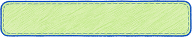
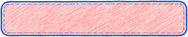

### 10.2 Попапи (`src/ui/Popup.ts`)

Один композитний конструктор вікна з блоків: іконка/емодзі → заголовок →
підкреслення (`deco_underline`) → секція (міні-ілюстрація) → зірки →
тіло → нотатка → кнопки. Дві варіації:

- `panel` — біла діалогова панель `ui_panel`, стоїть **рівно**.
- `note` — жовтий стікер `ui_panel_note` з **загнутим кутом** (асиметричний
  nine-slice 24/52/24/56) і клаптиком скотчу зверху, стоїть під кутом ~1.2°.
  Використовується для туторіалів (як приклеєна записка).

Затемнення фону — не чорний прямокутник, а **сам папір `bg_paper`** із
сірим тінтом (`#9599a3` @ alpha 0.86): дифон не «вимикається», а
«притемнюється як сторінка». Тінь картки — `ui_shadow` (nine-slice).
Поява — `scale 0.85→1`, `Back.easeOut` 220мс.

Прев'ю: 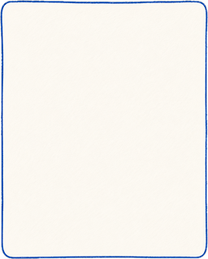
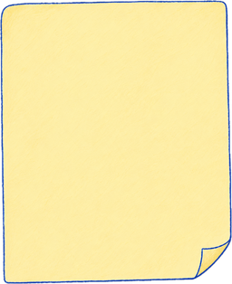
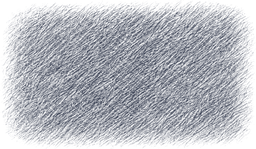

**Міні-ілюстрації туторіалів** збираються з *живих ігрових ассетів*
(`buildTutorialArt`), без окремого арту: колонка + блоки + пунктирна
дуга-стрілка + (за потреби) червоне перекреслення «так не можна». Це теж
правило: пояснення механіки малюється тими самими деталями, що й сама гра.

### 10.3 HUD і панель бустерів

Три горизонтальні зони (див. `mockup-spec.md`): HUD зверху (рівень/ціль,
ходи, назад, рестарт), поле по центру, панель бустерів знизу (назад-хід,
лупа, ключ — по центру, 76×52). Все прив'язане до safe-area. Ландшафт —
слимкіші бари, щоб віддати вертикаль полю.

### 10.4 Клітинки рівнів (лоббі)

4 стани, кожен зі своїм скіном + тінт-фолбеком: `lvl_cell` (звичайна),
`lvl_cell_current` (поточна, жовта, зі штрихами-«вусами» в кутах з
`deco_sparkle`), `lvl_cell_done` (зелена, з зірками рейтингу),
`lvl_cell_locked` (сіра, із сірим замком). Клітинки стоять з нахилом
±1.2° (парні/непарні) — «приклеєні криво». Номер — Caveat.

Прев'ю: 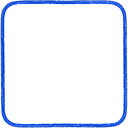
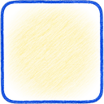
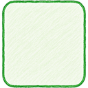
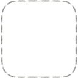

---

## 11. Іконки

96×96 @2x, PNG з альфою, у стилі «намальовано ручкою». Рендеряться через
`setDisplaySize` під контекст (бустери ~віконні, у бирках 15px, у польоті
26px). Набір: `icon_back`, `icon_restart`, `icon_settings`, `icon_play`,
`icon_undo`, `icon_lens`, `icon_key`, `icon_lock`, `icon_lock_gray`,
`icon_star_full`, `icon_star_empty`.


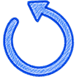


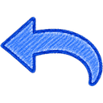


Кожна іконка має emoji-фолбек у коді (`🔑`, `🔒`, `↺`, `←`, `⚙`) — гра не
ламається без арту.

---

## 12. Nine-slice: правила

Рамки/кнопки/панелі тягнуться nine-slice'ом: кути фіксовані, краї
тягнуться. Значення — у `manifest.json → nineslice`.

- Кути мають бути самодостатні в **24px** (для `ui_panel` — 26px).
- Центр і середини країв — однорідні (жодних деталей, що деформуються).
- Декор (заклепки, віньєтки) — тільки в кутах.
- Асиметрія дозволена: `ui_panel_note` = `{left:24, right:52, top:24,
  bottom:56}` — місце під загнутий кут знизу-справа.

| Ассет | left | right | top | bottom |
|---|---|---|---|---|
| `col_frame` / `_selected` / `_target` / `_tint` | 14 | 14 | 14 | 14 |
| `ui_button` / `_success` / `_danger` | 20 | 20 | 20 | 20 |
| `ui_button_light` | 18 | 18 | 18 | 18 |
| `ui_panel` | 26 | 26 | 26 | 26 |
| `ui_panel_note` | 24 | 52 | 24 | 56 |
| `ui_shadow` | 44 | 44 | 40 | 40 |

---

## 13. Ассет-пайплайн (короткий чек-ліст)

Повний — у [`asset-spec.md`](asset-spec.md). Стисло:

- **PNG-24 + альфа**, прозорий фон (крім `bg_paper`). Padding 2–4px.
- **@2x**: усі розміри в ТЗ — фінальний експорт @2x (гра рендерить ~вдвічі
  менше). Не апскейлити з меншого.
- **Ім'я файлу = ключ у грі**, `snake_case`, без кирилиці/пробілів. Помилка
  в імені → ассет не підхопиться.
- **Без запеченого тексту.**
- Тінь — тільки в межах канви ассета.
- Кожен ассет читається на кремовому фоні гри.
- Реєстрація: `public/assets/manifest.json`. Немає в маніфесті →
  процедурний фолбек.
- Після зміни арту блоків → `node tools/art/sample-block-tints.mjs`.

**Retina/HiDPI:** канвас рендериться в *фізичних* пікселях, камера зумиться
на DPR (`src/core/utils/hidpi.ts`), код усюди мислить у *логічних* px. Стеля
DPR = 3 (iPhone Pro Max) — вище fill-rate не вартий.

---

## 14. Рецепт: додати візуал нової механіки «в стилі»

Покроково, з опорою на правила вище:

1. **Знайди предмет** (розділ 7). Яка річ зі світу зошита виконує цю дію?
   Стан спокою + реакція на «не можна» + реакція на «виконано».
2. **Процедурний фолбек спершу** (розділ 1, 5). Намалюй кодом у sketch-стилі
   через `strokeSketchRect`/`fillPattern`/існуючі хелпери. Це і є
   специфікація стилю.
3. **Колір — з палітри** (розділ 2). Якщо треба «під колір блока» —
   `BLOCK_TINTS`.
4. **Подвоюй кодування** (розділ 3.2), якщо вводиш новий тип-об'єкт:
   колір + форма/символ, читабельно в ч/б.
5. **Рух — дієсловами предмета** (розділ 9). Тайминги → в
   `GAME_SETTINGS.animation`. `Back.easeOut` для «живого» settle,
   `Sine/Cubic` для гравітації.
6. **Ключ ассета** → `ASSET_KEYS` (`assetManifest.ts`), із фолбеком у коді
   поруч (`hasTexture(...) ? art : procedural`).
7. **Туторіал** — міні-сцена з живих ассетів (`buildTutorialArt`), стікер
   `note`, копірайт українською (`UI_TEXTS`).
8. **ТЗ художнику** — рядок у `asset-spec.md`: розмір @2x, nine-slice
   (якщо тягнеться), опис. Прозорий останній кадр для анімацій.
9. **Не забудь** пройти контракт механіки (Types → Parser → Model →
   ViewContract → View → StubView → Controller, див. `ARCHITECTURE.md`) —
   візуал живе у View, але StubView і контракт пропускати не можна.
10. **Перевірка**: quality gates (`tsc`, тести, lint, build). Візуал
    розробник дивиться сам у білді — після UX/візуальних правок зібрати
    standalone і дати посилання.

---

## 15. Реєстр ассетів

Повний перелік — у [`manifest.json`](../public/assets/manifest.json).
Категорії:

- **Фон:** `bg_paper`.
- **Блоки:** `block_0`…`block_7`, `block_hidden`, `block_key`, `block_ink`.
- **Колонки:** `col_frame`, `col_frame_selected`, `col_frame_target`,
  `col_frame_tint`.
- **Механіки-предмети:** `icon_lock`, `icon_lock_gray`, `icon_key`,
  `deco_tape`, `tape_flap`, `deco_seal`, `deco_ribbon`, `deco_chain`.
- **UI:** `ui_button`, `ui_button_primary`, `ui_button_success`,
  `ui_button_danger`, `ui_button_light`, `ui_button_square`, `ui_panel`,
  `ui_panel_note`, `ui_shadow`.
- **Іконки:** `icon_back`, `icon_restart`, `icon_settings`, `icon_play`,
  `icon_undo`, `icon_lens`, `icon_star_full`, `icon_star_empty`.
- **Клітинки лоббі:** `lvl_cell`, `lvl_cell_current`, `lvl_cell_done`,
  `lvl_cell_locked`.
- **Декор:** `deco_doodle_01`…`30`, `deco_sort_01`…`10`, `deco_underline`,
  `deco_sparkle`.
- **Анімації (атлас `fx`):** `block_clear_*`, `sparkle_*` (+ 2-й пріоритет:
  `lock_open_*`, `hand_tap_*`, `win_confetti_*`).

---

*Оновлювати цей документ разом зі зміною візуальних рішень. Він — місток
контексту між дизайном (чати «Puzzle Hub»), кодом і художником.*
